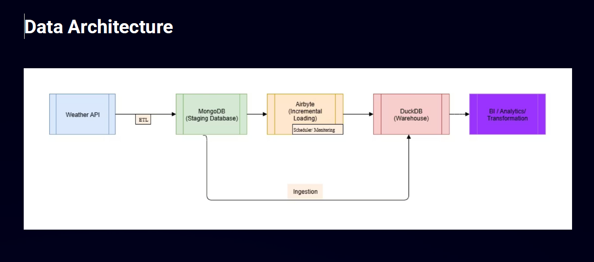

# Weather ETL Pipeline

## Architecture

This project implements an incremental ETL workflow for collecting hourly weather forecasts, moving data from **Weatherbit API → MongoDB → Airbyte → MotherDuck**.
It covers the full data engineering process from ingestion to analytics-ready datasets.

# How the Pipeline Works

1. **Extract** – Pulls hourly forecast data from the Weatherbit API.

2. **Transform** – Converts JSON responses into a structured, normalized schema.

3. **Load (staging)** – Inserts or updates records in MongoDB using unique IDs and indexed collections.

4. **Incremental Sync** (Replicate) – Uses Airbyte to transfer only new or updated records to the warehouse while avoiding   duplicates.

5. **Analytics Warehouse** – Prepares query-friendly tables in MotherDuck for analysis and reporting.

# Technology Stack

**Python** – Handles API calls, normalization and MongoDB operations.

**MongoDB** – Staging database with replica sets and indexes for performance.

**Airbyte** – Performs incremental replication with primary key + cursor logic.

**MotherDuck** – Serves as the analytics-ready warehouse for fast querying.

# Key Highlights

- Supports hourly incremental updates

- Ensures data deduplication through deterministic IDs

- Provides ready-to-query datasets for analytics

- Demonstrates end-to-end pipeline design from API ingestion to warehouse

